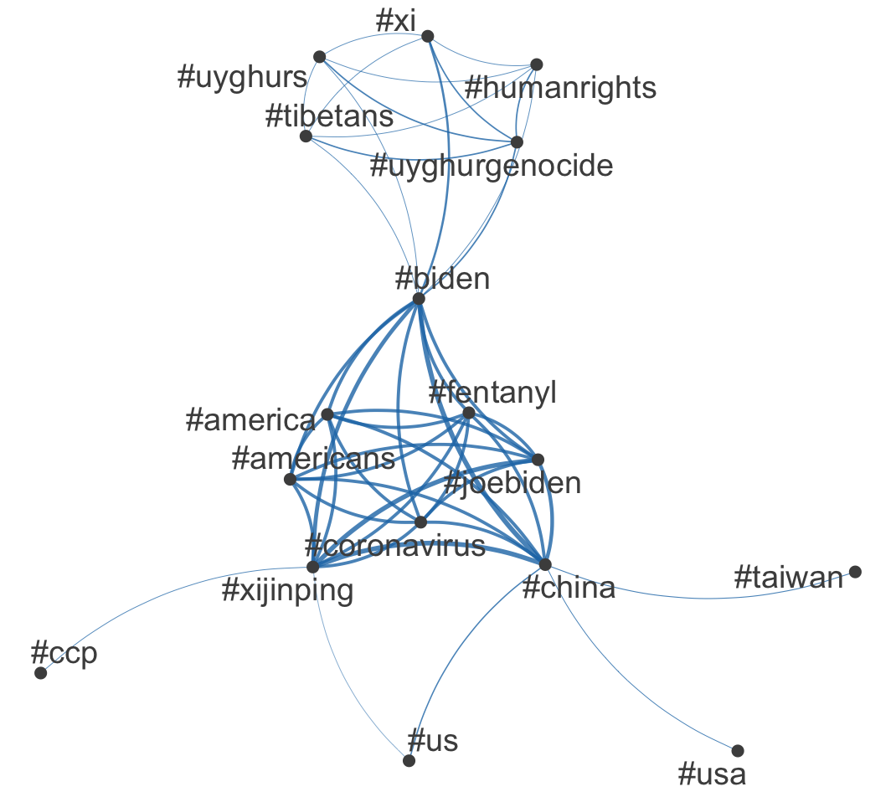

```{r}
library(quanteda)
library(quanteda.textmodels)
library(quanteda.textplots)
library(readr)
library(ggplot2)

summit <- read_csv("https://raw.githubusercontent.com/datageneration/datamethods/master/textanalytics/summit_11162021.csv")

sum_twt = summit$text
toks = tokens(sum_twt)
sumtwtdfm <- dfm(toks)
class(toks)

sum_lsa <- textmodel_lsa(sumtwtdfm, nd=4,  margin = c("both", "documents", "features"))
summary(sum_lsa)
head(sum_lsa$docs)
class(sum_lsa)

tweet_dfm <- tokens(sum_twt, remove_punct = TRUE) %>%
  dfm()
head(tweet_dfm)

tag_dfm <- dfm_select(tweet_dfm, pattern = "#*")
toptag <- names(topfeatures(tag_dfm, 50))
head(toptag, 10)
library("quanteda.textplots")
tag_fcm <- fcm(tag_dfm)
head(tag_fcm)
topgat_fcm <- fcm_select(tag_fcm, pattern = toptag)
textplot_network(topgat_fcm, min_freq = 50, edge_alpha = 0.8, edge_size = 1)
```



This plot displays the networks of hashtags used on Twitter during the Biden-Xi summit in November 2021. Most central are the names of the politicians and the countries, as well as the term coronavirus and fentanyl, which shows the importance of these two crisis for the twitter users.

```{r}
library(quanteda)
library(quanteda.textmodels)
library(quanteda.textplots)
library(readr)
library(ggplot2)

dfm_inaug <- corpus_subset(data_corpus_inaugural, Year <= 1826) %>%
  tokens() %>% 
  tokens_remove(stopwords('english')) %>% 
  tokens_remove("[[:punct:]]", valuetype = "regex") %>%
  dfm() %>%
  dfm_trim(min_termfreq = 10, verbose = FALSE)
set.seed(100)
textplot_wordcloud(dfm_inaug)
inaug_speech = data_corpus_inaugural

data_corpus_inaugural_subset <- 
  corpus_subset(data_corpus_inaugural, Year > 1949)
kwic(tokens(data_corpus_inaugural_subset), pattern = "american") %>%
  textplot_xray()
```

In this lexical dispersion plot one can see the usage of the word american during the inaugural speeches of the presidents of the US since 1953. Only by looking at the plot there seem to not be huge differences in the usage of the word. Eisenhower though only used it once, and is did get more popular in the more recent past. But for example between President Trump and President Biden the difference is not very big.

**What is Wordfish?**

With the help of **Wordfish** one can estimate the positions of a text or a document on a specific topic by analyzing the words used within the text.
