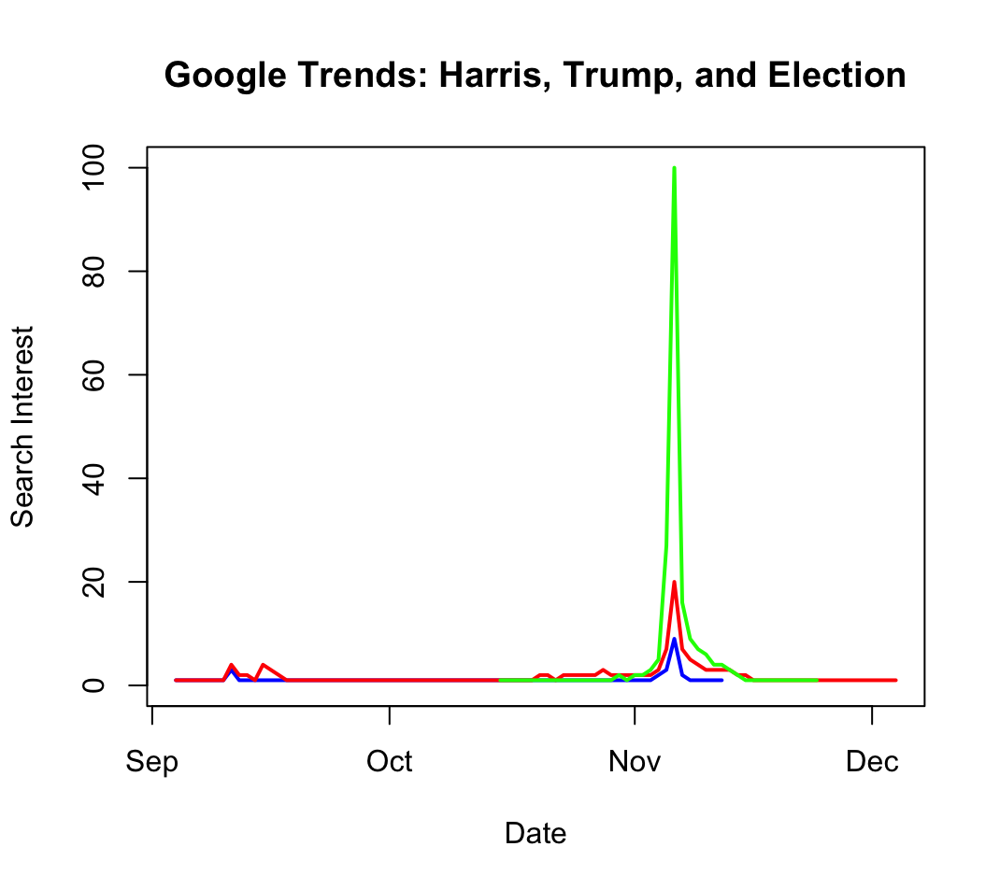
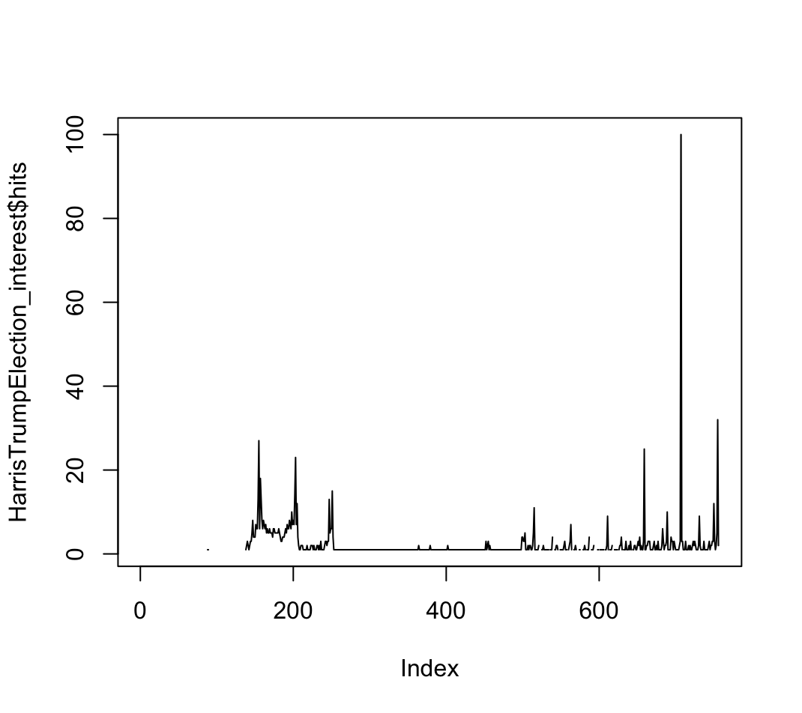

I downloaded data for the terms "Trump", "Harris" and " Election"on the Google Trends Website as a csv.file for the last 90 days - September 4th to December 3rd 2024 - and converted it to an Excel file. I loaded the Excel file into R and started analyzing the data.

```{r}
library(readxl)
GTrends <- read_excel("~/Downloads/GTrends.xlsx")
colnames(GTrends) <- c("Day", "Trump", "Harris", "Election")
GTrends$Day <- as.Date(GTrends$Day)

plot(GTrends$Day, GTrends$Harris, type = "l", col = "blue", lwd = 2,
     xlab = "Date", ylab = "Search Interest", main = "Google Trends: Harris, Trump, and Election",
     ylim = c(0, 100))

lines(GTrends$Day, GTrends$Trump, col = "red", lwd = 2)
lines(GTrends$Day, GTrends$Election, col = "green", lwd = 2)
```

{fig-align="center"}

When looking at the data, one can see how at the day of the Election the term election was way more searched for than the candidates names Trump or Harris. Due to this peak of the term Election being searched much more on November 6th compared to any other term at any other date, it is very hard to analyze the data based on this graph and this chosen time frame any further. This shows a big disadvantages of Google Trends, as it is only a relative measure.

```{r}
## Install package
##install.packages("gtrendsR")

## Load library and run gtrends
library(gtrendsR)
HarrisTrumpElection = gtrends(c("Trump","Harris","election"), time = "all")

## Select data for plotting
HarrisTrumpElection_interest <- HarrisTrumpElection$interest_over_time

## Plot data
plot(HarrisTrumpElection_interest$hits, type="l")
```



Instead of first downloading the data on the website as a csv file, convert it to an Excel and then import it to R and plot and analyze the data, with the help of the gtrendsR package this can be done more easily. The package simplifies it and makes it easier to download more data faster.
